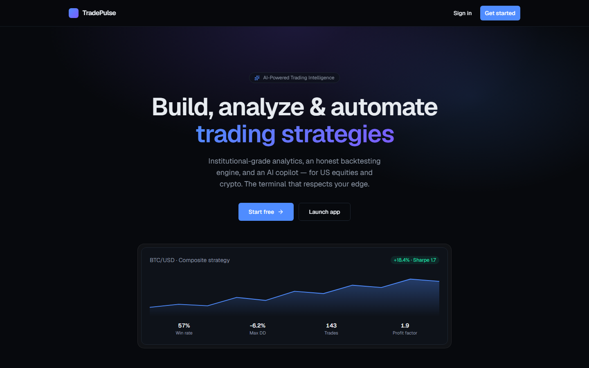

<div align="center">

# 📈 TradePulse

### AI-powered algorithmic trading intelligence — US equities + crypto.

Live market data, interactive charts, a strategy builder, an **honest event-driven backtester**,
paper trading, and an **AI copilot** (NL → strategy) — a production-grade, SaaS-ready platform.
*(Live real-money trading is a gated, deferred phase.)*

[](https://ai-powered-trading-system.vercel.app)
&nbsp;
[](https://mubin-attar-007-tradepulse.hf.space)


<br/>



</div>

---

A production-grade, personal-first (SaaS-ready) platform for **US equities + crypto**: market data,
charting, a strategy builder, an honest event-driven backtester, paper trading, and an AI copilot.

## Stack
- **Backend:** Python 3.12, FastAPI, Pydantic v2, SQLAlchemy 2.0 (async), Alembic, ARQ
- **Data:** PostgreSQL + TimescaleDB, Redis
- **Market data (free):** CCXT (crypto OHLCV) + yfinance (equities) out of the box; Alpaca optional (free paper keys)
- **Frontend:** Next.js (App Router) + TypeScript + Tailwind + shadcn/ui (TanStack Query + Zustand)
- **AI (free):** Google Gemini (free tier) by default, or a local Ollama model — both no-cost
- **Tooling:** `uv` (Python), `npm` (web), `just` (tasks), Docker Compose, Caddy (prod)

## Quick start
```bash
cp .env.example .env          # then fill secrets (see comments in the file)
just bootstrap                # uv sync + docker up + migrate
just seed                     # register the equity + crypto instrument universe
just backfill BTC/USD 2       # pull 2 days of REAL 1m bars (free, via CCXT) — repeat per symbol
just api                      # FastAPI at http://localhost:8080  (/docs, /health)
just worker                   # ARQ worker: live ingestion + paper-trading cron
just web                      # Next.js at http://localhost:3000
```

## Layout
```
apps/
  api/                  FastAPI app + ARQ worker (modular monolith)
    app/
      core/             kernel: config, db, redis, security, errors, events, observability
      modules/
        auth/           users, sessions, credentials, broker_connections (encrypted)
        market_data/    instruments, OHLCV store, providers (ccxt/yfinance/alpaca), realtime
        strategies/     canonical StrategySpec DSL, CRUD, versioning
        backtesting/    event-driven engine, metrics, async orchestration
        trading/        paper engine, portfolio, brokers + gated live seam
        ai/             LLM copilot (Gemini/Ollama): NL->spec, narration
        audit/          append-only event log
      cli/              seed, backfill, export_openapi
    alembic/            migrations (single linear head)
    tests/              unit + integration + financial-correctness
  web/                  Next.js frontend (app router, generated typed API client)
packages/contracts/     OpenAPI spec -> generated TS client + zod
infra/                  Dockerfiles, compose.prod.yaml, Caddyfile, deploy/backup scripts, observability
docs/                   DEPLOY runbook + Architecture Decision Records (docs/adr/)
```

## Guiding invariants
1. Every domain row is `owner_id`-scoped (SaaS-ready tenancy).
2. Money is `Decimal`/`NUMERIC` server-side; it crosses the API as decimal strings.
3. One bar lifecycle (`forming → is_final`); decisions only ever act on closed bars.

## Security & ops
- `/metrics` is gated by `METRICS_TOKEN` (404 without it); request bodies capped at `MAX_REQUEST_BYTES`;
  market-data provider calls bounded by `MARKET_DATA_TIMEOUT_SECONDS`.
- DSN-gated **Sentry** on the API (`SENTRY_DSN`) and web (`NEXT_PUBLIC_SENTRY_DSN`); CSP + React error
  boundaries on the frontend.
- CI adds informational `pip-audit` / `npm audit` + a coverage report alongside the existing
  mypy / import-linter / migration / OpenAPI-drift gates. Backups: `infra/backup.sh` (nightly) +
  `infra/restore.sh` (monthly restore-verify). See [docs/](docs/).

## License
Proprietary — © 2026 Mubin Attar. All rights reserved. Personal and commercial
use is reserved to the owner; no third-party use without written permission.
See [LICENSE](LICENSE).
